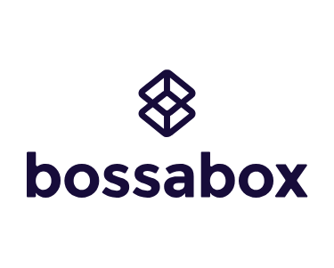

[](https://travis-ci.com/deividr/vuttr-backend)
[](https://coveralls.io/github/deividr/vuttr-backend?branch=master)



# VUTTR - Very Useful Tools to Remember

API to manage tools with their respective names, links, descriptions and tags

> This project is to meet [**BossaBox**][bossabox] backend challenge.

# Project structure

This is a backend Rest API.

## 🛠️ Technologies

These are the technologies used throughout the project:

-  [Node.js][nodejs]
-  [TypeScript][typescript]
-  [Docker][docker]

# How to install and run

## 📌 Prerequisites

You need install:

- [Node.js][nodejs] (prefer version 12.17.0 or higher)
- [Yarn][yarn] (prefer version 1.21.1 or higher)
- [Docker][docker]

Clone this repository:

```bash
# Clone this repository
$ git clone https://github.com/deividr/nlw-01

# Go into the repository
$ cd nlw-01
```

## 🖥️ Server Side

Install process:

```bash
# Go into the folder server
$ cd server

# Install package's
$ yarn install

# Go to into the folder database configuration
$ cd src/database

# Executes migrations with knex
$ yarn knex:migrate

# Insert datas execute seeds
$ yarn knex:seed
```

Run process:

```bash
# Run with ts-node-dev for watch modify files and restart server
$ yarn dev
```

## 🌐 App Web

> 🏷️ Server needs to be running

Install process:

```bash
# Go into the folder web
$ cd web

# Install package's
$ yarn install
```

Run process:

```bash
$ yarn start
```

## 📱 App Mobile

> 🏷️ Server needs to be running

Install process:

```bash
# Go into the folder mobile
$ cd mobile

# Install package's
$ yarn install
```

Run process:

```bash
$ yarn start
```

# 📥 Improvements

##### 🖥️ Server Side

- Not allow the upload of files other than images

##### 📱 App Mobile

- Includes selector field to Federal Unity
- Includes selector field to City
- Integration with the IBGE API for get Federal Unity and City

# 📝 License

This project is under the MIT license. See the [LICENSE](LICENSE) for more information.

[nodejs]: https://nodejs.org/
[typescript]: https://www.typescriptlang.org/
[yarn]: https://yarnpkg.com/
[vc]: https://code.visualstudio.com/
[vceditconfig]: https://marketplace.visualstudio.com/items?itemName=EditorConfig.EditorConfig
[vceslint]: https://marketplace.visualstudio.com/items?itemName=dbaeumer.vscode-eslint
[bossabox]: https://bossabox.com/para-empresas
[docker]: https://www.docker.com/

---

For more about [me:crown:](https://www.linkedin.com/in/deivid-assump%C3%A7%C3%A3o-rodrigues-a36a5685/).
